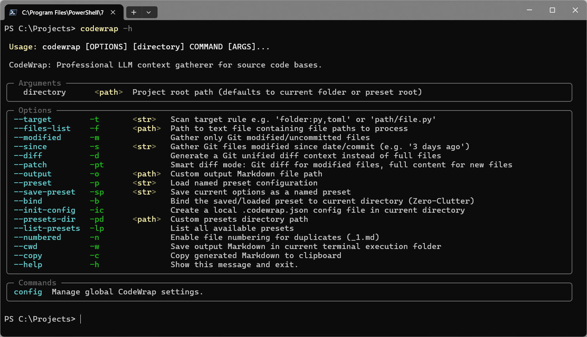

# CodeWrap

**CodeWrap** is a professional CLI tool that gathers source code context into a single Markdown file, ready to be fed into an LLM (GPT, Claude, etc.). It walks your project, respects `.gitignore`, skips binary files, and reports approximate token counts via `tiktoken`.



## Features

- **Full project scan** — wrap an entire codebase or targeted subsets (`folder:ext1,ext2`, single files) into one Markdown document.
- **Git-aware modes:**
  - `--modified` — only files with uncommitted changes.
  - `--since <ref>` — files changed since a date or commit.
  - `--diff` — unified Git diff as context.
  - `--patch` — smart patch: diffs for modified files, full content for newly staged ones.
- **Presets & Zero-Clutter bindings** — save reusable scan configurations, bind them to folders, or use a local `.codewrap.json`.
- **Accurate token counting** — `tiktoken` encodings (`o200k_base` by default) with a graceful fallback estimate.
- **Smart filtering** — honors `.gitignore` plus built-in exclusions (`.venv/`, `__pycache__/`, `node_modules/`, binary files, previous outputs).
- **Clipboard integration** — copy the generated Markdown straight to the clipboard.

## Installation

Requires Python 3.10+.

```bash
# With uv
uv tool install codewrap

# Or with pip
pip install codewrap
```

For clipboard support on Linux, a system backend such as `xclip` or `wl-clipboard` may be required.

## Quick Start

```bash
# Wrap the current Git repository (tracked files auto-detected)
codewrap .

# Wrap a folder, Python and TOML files only
codewrap . --target "src:py" --target "pyproject.toml"

# Only uncommitted changes
codewrap . --modified

# Files changed in the last 3 days
codewrap . --since "3 days ago"

# Unified diff of uncommitted changes as context
codewrap . --diff

# Smart patch: diffs for modified + full content for staged new files
codewrap . --patch
```

The result is saved as `<project>_context.md` next to the project root (or in the current directory with `--cwd`), and the token count is printed when done.

## Target Rules

Targets are passed via `--target/-t` using the syntax `path:extensions`:

| Rule | Meaning |
| --- | --- |
| `"src:py"` | all `.py` files under `src/` |
| `"src:py,toml"` | all `.py` and `.toml` files under `src/` |
| `"src/utils.py"` | a single file |
| `"tests"` | everything under `tests/` (no extension filter) |

## Presets and Local Configuration

```bash
# Save the current options as a named preset
codewrap . --target "src:py" --save-preset myproj

# Reuse a preset
codewrap . --preset myproj

# Bind a preset to the current folder — future bare runs auto-load it
codewrap . --preset myproj --bind
codewrap .   # <- automatically uses 'myproj'

# Create a local .codewrap.json config for the repository
codewrap . --init-config
```

Presets are stored in `~/.codewrap/presets/*.json`. A custom location can be set per run via `--presets-dir`.

## Global Settings

```bash
codewrap config show          # print current settings
codewrap config set --numbered true --copy true
codewrap config reset         # restore defaults
```

Session-only flags (`--numbered`, `--cwd`, `--copy`, `--presets-dir`) affect a single run and do not modify global settings.

## Output Format

The generated Markdown groups each file into a fenced block tagged with its extension:

````markdown
# Project Context: my-project

## File: src/main.py
```python
...file content...
```
````

Diff modes produce `` ```diff `` blocks instead. Token counts are computed with `tiktoken`; if it is unavailable, a rough `len / 4` estimate is used.

## Development

```bash
git clone https://github.com/goloveshko/codewrap.git
cd codewrap
uv sync

uv run ruff check src/
uv run mypy src/
uv run pytest
```

## Support & Feedback

Developed with ❤️ by Sergey Goloveshko.

- **Telegram Support Bot**: [@itz2bot](https://t.me/itz2bot?start=github_codewrap)
- **Portfolio**: [goloveshko.github.io](https://goloveshko.github.io)
- **GitHub Issues**: [Report a bug](https://github.com/goloveshko/codewrap/issues)

## License

This project is licensed under the [MIT License](LICENSE).