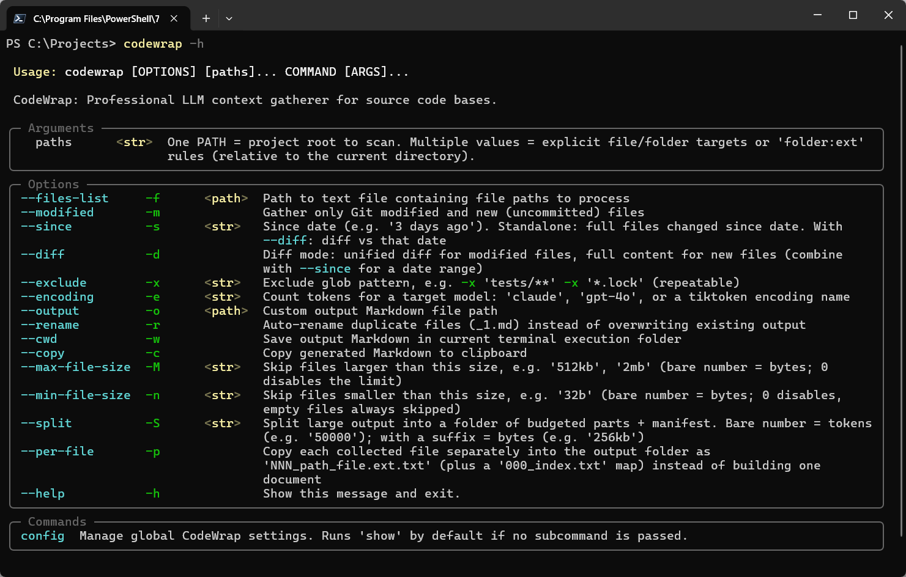

# CodeWrap

**CodeWrap** is a professional CLI tool that gathers source code context into a single Markdown file, ready to be fed into an LLM (GPT, Claude, etc.). It walks your project, respects `.gitignore`, skips binary files, and reports token counts via `tiktoken`.



## Features

- **Full project scan** — wrap an entire codebase or explicit targets (files, `folder:py,toml` rules) into one Markdown document.
- **Git-aware modes:**
  - `--modified` (`-m`) — only files with uncommitted changes (untracked files included).
  - `--diff` (`-d`) — smart diff: unified diff for modified files, full content for new ones.
  - `--since <date>` (`-s`) — files committed since a date; with `-d`, the diff since that date.
- **Exclusions** — repeatable `-x/--exclude` git-style globs on top of `.gitignore` and built-in defaults.
- **Honest token counting** — totals are measured over the final document with `tiktoken`; choose the encoding by target model (`-e claude`, `-e gpt-4o`) and the summary states exactly what was used (or marks a rough estimate and why).
- **Transparent filtering** — content-based binary sniffing plus a size window: `--min-file-size` floor (default `32b`, drops placeholder/trivial files; empty files are always skipped) and `--max-file-size` cap (default `512kb`); every skip is listed at the end of the document with a reason code and size, and the file format is explained up front for the model reading it.
- **Smart filtering** — honors `.gitignore` plus built-in exclusions (`.venv/`, `__pycache__/`, `node_modules/`, `dist/`, `build/`, dependency lockfiles like `uv.lock`/`package-lock.json`, minified assets and source maps, binary files, previous outputs).
- **Auto-rename protection** — optional `--rename` (`-r`) mode appends incremental suffixes (`_1.md`, `_2.md`) to prevent accidental overwrites.
- **Per-file bundle** — `--split` packs files into budgeted parts (a token count like `50000`, or a size like `256kb`) inside a folder with a `manifest.md`; `--per-file` (`-p`) instead copies every collected file as its own raw attachment (`001_src_engine.py.txt`) into a folder, so you can eyeball real file sizes and drop oversized ones before pasting.
- **Clipboard integration** — copy generated Markdown straight to the clipboard (`-c` / `--copy`).

## Installation

Requires Python 3.10+.

```bash
# With uv
uv tool install codewrap

# Or with pip
pip install codewrap
```

For clipboard support on Linux, a system backend such as `xclip` or `wl-clipboard` may be required.

## Quick Start

```bash
# Wrap current Git repository (tracked files auto-detected)
codewrap

# Wrap another project root
codewrap C:\Projects\myapp

# Explicit targets: everything under src/ that is .py/.toml, plus one file
codewrap "src:py,toml" pyproject.toml

# Everything except tests and lock files
codewrap -x "tests/**" -x "*.lock"

# Only uncommitted changes, copied to clipboard
codewrap -m -c

# Smart diff of uncommitted changes (diff for modified, full content for new files)
codewrap -d -c

# Diff of everything committed in the last 3 days
codewrap -d -s "3 days ago"

# Count tokens for Claude instead of GPT-4o
codewrap -e claude .

# Skip any file over 256kb (default cap is 512kb; 0 disables it)
codewrap -M 256kb

# Keep files under the 32b floor too (empty files are still skipped)
codewrap -n 0

# Split a big context into ~50k-token parts under a folder + manifest
codewrap -S 50000

# Or copy every file separately into a folder as numbered .txt attachments
codewrap -p

# Prevent overwriting existing context file by auto-renaming (_1.md)
codewrap -r
```

The result is saved as `<project>_context.md` next to the project root (or in current working directory with `--cwd` / `-w`).

Source options (`-m`, `-s`, `-f`, target arguments) are mutually exclusive — combining them fails fast instead of applying hidden precedence.

## Target Syntax

Targets are plain positional arguments (use `-f/--files-list` for long lists):

| Argument | Meaning |
| --- | --- |
| `src` | everything under `src/` |
| `"src:py"` | all `.py` files under `src/` |
| `"src:py,toml"` | all `.py` and `.toml` files under `src/` |
| `src/utils.py` | a single file |

A single existing directory argument is treated as the project root; two or more arguments are treated as targets relative to the current directory.

## Global Settings

```bash
codewrap config                   # view global configuration table
codewrap config tokenizers        # view encodings, model aliases, and notes
codewrap config set --tokenizer claude --copy
codewrap config show --json       # export raw JSON for scripting
codewrap config reset             # restore all defaults
```

Session-only flags (`-r`, `-w`, `-c`, `-e`, `-M`, `-n`) affect a single run; persistent defaults (including `max_file_size` and `min_file_size`) can be changed via `codewrap config set`.

## Output Format

The generated Markdown groups each file into a fenced block tagged with its extension:

````markdown
# Project Context: my-project

## File: src/main.py
```python
...file content...
```
````

Diff modes produce `` ```diff `` blocks instead.

When files are skipped (binaries, size cap, exclusions), the document opens with a short legend explaining the reason codes and ends with an **Excluded files** table listing each skipped file with its size and code (`BINARY`, `EXCLUDED`, `LARGE`, `UNREADABLE`).

With `-S/--split`, output that fits inside one budget is still a single file; otherwise a `<name>_context/` folder is written instead, containing `part_01.md`, `part_02.md`, … and a `manifest.md` index (files, tokens, and size per part). Paste the parts into the chat one by one, in order.

With `-p/--per-file`, no document is built at all: each collected file is copied raw into the folder as `NNN_path_to_file.ext.txt` — numbered in scan order, with the original path baked into the name and a `.txt` suffix so any chat UI accepts it. File sizes are visible at a glance, and you can delete oversized attachments before uploading.

## Development & Testing

```bash
git clone https://github.com/goloveshko/codewrap.git
cd codewrap
uv sync

uv run ruff check .
uv run mypy src/
uv run pytest
```

## Support & Feedback

Developed with ❤️ by Sergey Goloveshko.

- **Telegram Support Bot**: [@itz2bot](https://t.me/itz2bot?start=github_codewrap)
- **Portfolio**: [goloveshko.github.io](https://goloveshko.github.io)
- **GitHub Issues**: [Report a bug](https://github.com/goloveshko/codewrap/issues)

## License

This project is licensed under the [MIT License](LICENSE).